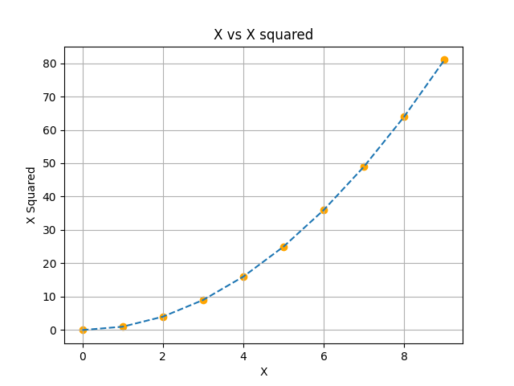
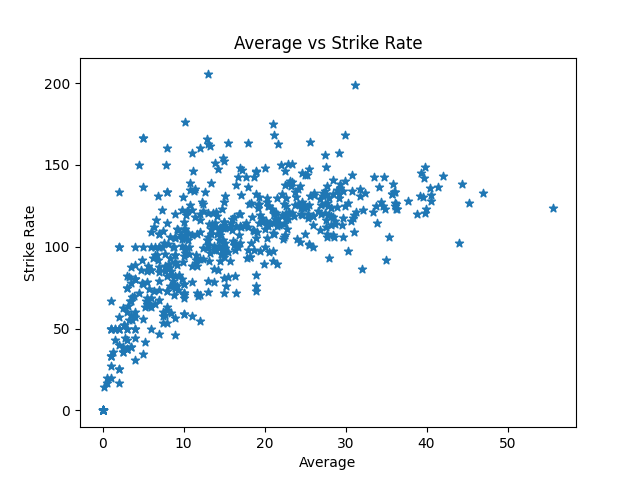
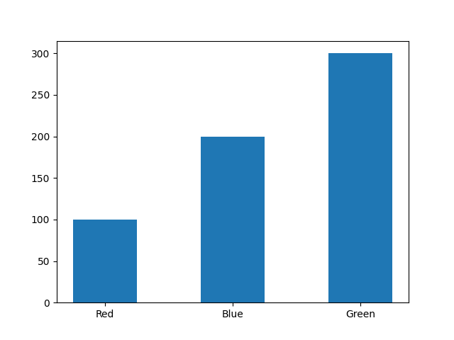
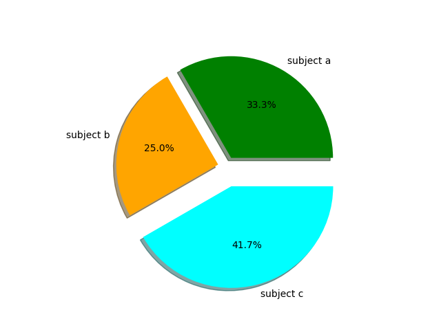

## Visualization with Matplotlib and Seaborn

In this folder I am learning about **Matplotlib** and **Seaborn**

## Quick Links

- [Matplotlib Plot, Pie, Bar Basic](./01_Matplotlib.ipynb)

---

## Plotting Examples:

    

        <h3>Simple Plot example:</h3>
        
    

    

        <h3>Scatter Plot Example:</h3>
        
    

    

        <h3>Bar Plot example:</h3>
        
    

    

        <h3>Pie Plot Example:</h3>
        
    

